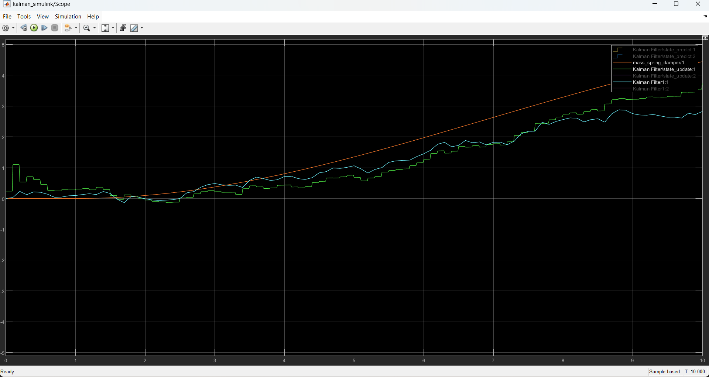

# simulink
#  Kalman Filter Simulation in Simulink

This project implements a custom 1D Kalman Filter in MATLAB/Simulink and compares it with the built-in Simulink Kalman Filter block. The system is tested using a mass-spring-damper model with a noisy position sensor.

## 🔧 Features
- Custom Kalman Filter implemented using MATLAB Function blocks
- Mass-Spring-Damper physical simulation as test system
- Comparison with built-in Simulink Kalman Filter
- Noise injection for testing robustness
- Plotting & visualization of estimation vs true values

## 🧠 Concepts
- State-space modeling
- Kalman Filter (Predict + Update)
- Covariance propagation
- Simulink block design

## 🗂 File Structure
- `Simulink/`: Contains simulation `.slx` files and plots
- `MATLAB/`: MATLAB function files used inside Simulink
- `Docs/`: Screenshots and figures

## 📊 Results

## 📦 Requirements
- MATLAB R202x
- Simulink
- DSP System Toolbox (optional, for Simulink Kalman Filter block)

## 🚀 Run it
1. Clone the repo
2. Open `kalman_custom.slx`
3. Run the simulation
4. View results in Scope

## 📃 License
[MIT License](LICENSE)
